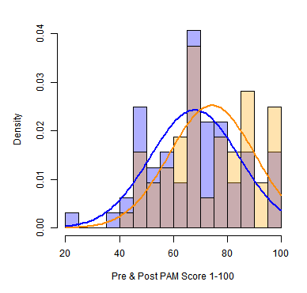
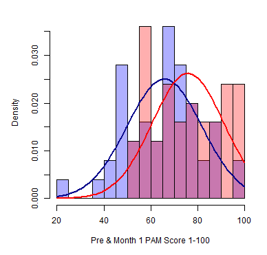
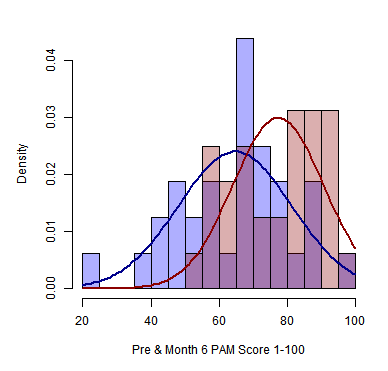

# The change in the Patient Activation Measure(PAM):
## The individial's knowledge, skill and confidence for managing one's health and healthcare.

### Cohen's d=0.4, small effect size
after initial education intervention

 

### Cohen's d=0.6, medium effect size
1 month after inital education intervention

 

### Cohen's d=0.8, large effect size
6 months after initial education intervention

 

##GIF

